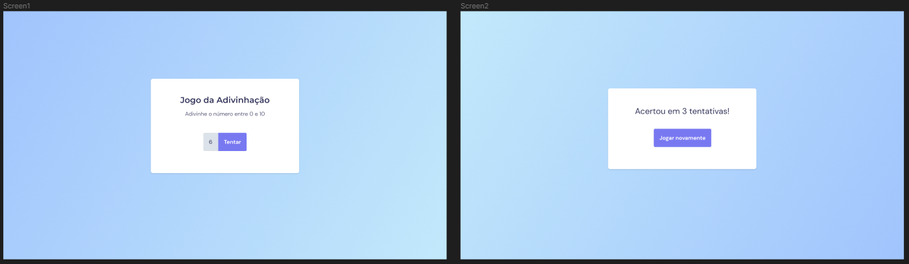

# 💻 Projeto: Guessing game (Jogo da adivinhação)

 

## 📌 Sobre o Projeto

Projeto desenvolvido no programa Explorer da Rocketseat.
Assuntos importantes aplicados: 

  * Funções - Js
  * Manipulação da DOM

Figma: https://www.figma.com/file/I3sT97Beg95aeV3KfHKh8P/Jogo-Adivinha%C3%A7%C3%A3o-(Copy)?node-id=0%3A1

 

## 📌 Tecnologias 

Esse projeto foi desenvolvido com as seguintes tecnologias:

* HTML
* CSS
* JavaScript

 

## 📝 Licença

Esse projeto está sob a licença MIT. Veja o arquivo [LICENSE](LICENSE) para mais detalhes.

 
 

<h4 align="center">
    Por Rodrigo de Morais 🚀
</h4>